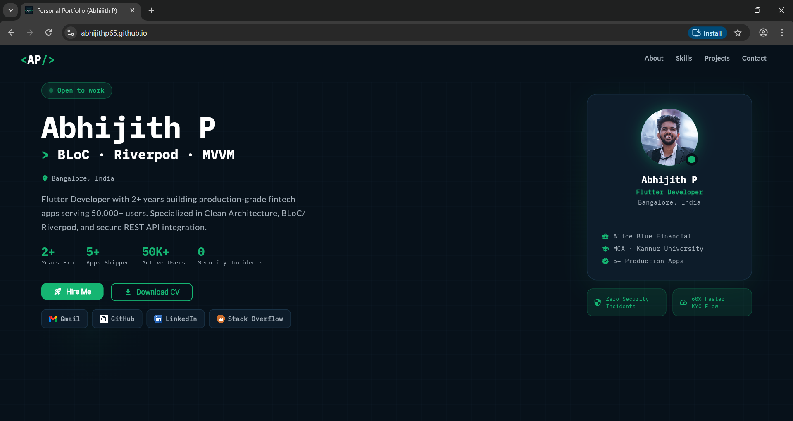
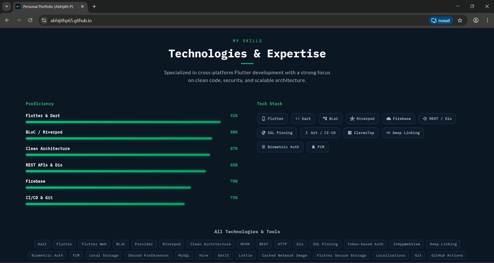
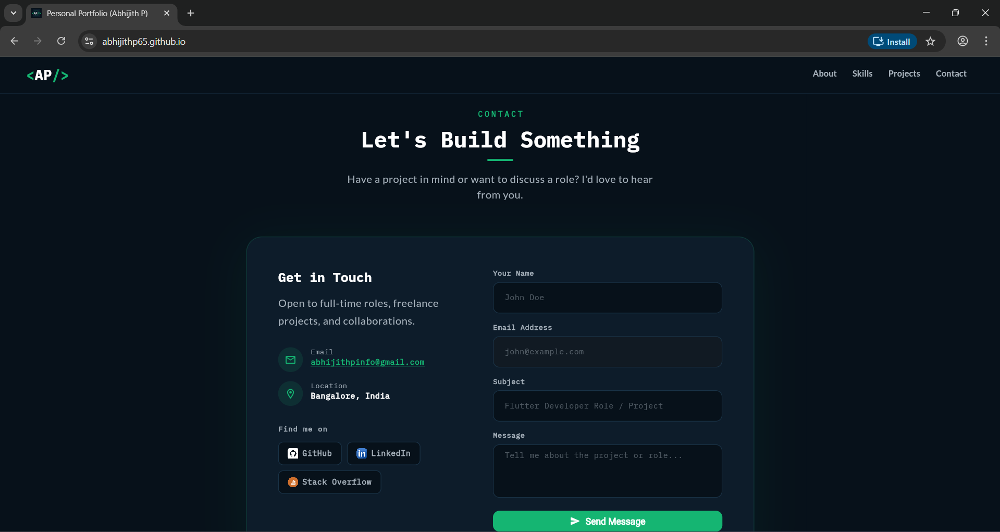

# Personal Portfolio 🌐

A modern **Flutter Web portfolio** built using **Flutter + Riverpod + Clean Architecture**.
This website showcases my projects, skills, and GitHub repositories dynamically using the GitHub API.

The site is automatically deployed using **GitHub Actions CI/CD** to **GitHub Pages**.

🔗 **Live Website:**
https://abhijithp65.github.io

---

# 🚀 Features

* Responsive Flutter Web UI
* Clean Architecture structure
* State management using Riverpod
* GitHub API integration to fetch repositories
* Automatic deployment with CI/CD
* Modern UI with smooth animations
* Fully responsive for desktop and mobile

---

# 🛠 Tech Stack

* **Flutter Web**
* **Dart**
* **Riverpod**
* **GitHub API**
* **GitHub Actions (CI/CD)**
* **GitHub Pages Hosting**

---

# ⚙️ CI/CD Deployment

This project uses **GitHub Actions** to automatically:

1. Install Flutter
2. Fetch dependencies
3. Build Flutter Web
4. Deploy to GitHub Pages

Every push to the `main` branch automatically updates the live site.

---

# 📸 Screenshots

---
